# 前言

这是大学时候上设计模式这门课，课程任务是要求结合五个设计模式写一个系统，最近偶然翻到，把系统分享一下。

# 成品预览

## 主界面      

​                   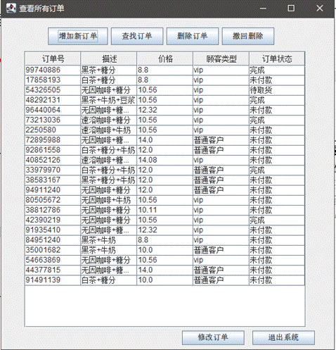

## 功能介绍

订单管理系统，实现了对订单的增删改查。且实现了将订单内容写入文件，每次增删改查都会做保存，下次重启程序时会自动加载之前已存入的订单，简单采用txt存文件到本地。  

功能描述：  

（1） 增加订单功能：能对不同商品组合实现实时计算价格，并且根据用户的身份产生vip用户价格和普通用户价格，并在订单添加到已有的订单列表中。并且内置了商品菜单，点击商品菜单按钮可以显示详细的商品菜单。  如果未确认选择先提交订单，会提示“订单为空，无法提交”。  如果未确认选择而单击撤回选择，会提示“订单为空无法撤回”。  如果未选择客户类型便进行确认选择，会提示“未选择客户类型”。        

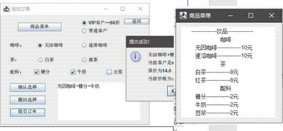                                           （2) 查找订单功能：输入订单号实现对订单查询操作。能实现对订单号格式的校验，只能是数字格式，并且非空，若格式错误会弹窗提示，当订单不存在时候也会弹出错误提示。

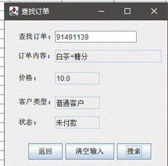                                        

（3） 删除订单功能：输入要删除的订单号，完成对订单的删除。并且可以撤回删除操作。当想恢复上一次删除的内容时，单击撤回删除按钮即可实现。能实现对订单号格式的校验，只能是数字格式，并且非空，若格式错误会弹窗提示，当订单不存在时候也会弹出错误提示                                    

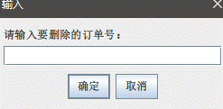                  

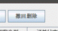                                   

（4） 修改功能：使用了JTable,直接双击表格文本框即可完成修改和保存。                                     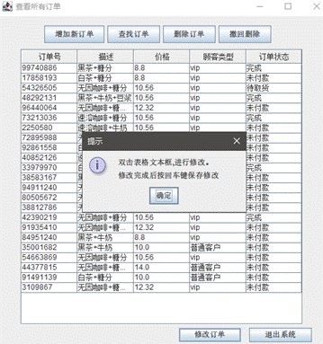                 

 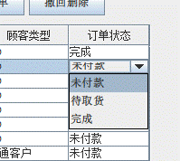                                                                 

#  使用的设计模式 

## 装饰者模式
在增加新订单中，对订单的计价和描述使用了装饰者模式。原先没有装饰者模式，则需要对每种组合都定义一个类，在类中设置其相关的价格和描述属性，将会使得类的数量庞大。应用该模式后，可以大大减少类的数量。  使用装饰者模式。有咖啡和茶两种饮品，都继承自一个抽象类Drink。配料有糖分，牛奶，豆浆三种配料，将配料作为decorator装饰饮品，继承自decorator，同时decorator又继承自Drink类。使用装饰模式，可以动态的给对象添加额外的功能，即包装原有的类。这样子，一个饮品添加多个配料，实现对饮品对象的多次包装，每次包装都后都能保存对象原有的功能属性。这种情况下，无需增加不同组合的类，即可完成对每个组合的商品描述和计价。       

 UML图：                               

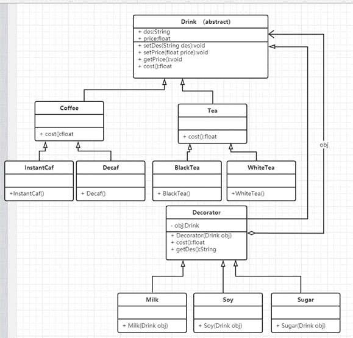                                    
## 组合模式
在增加新订单功能中，有显示商品菜单选项。对商品菜单的展示则应用了组合模式。如果菜单没有使用组合模式，将不能很好的实现管理操作，如对菜单的一级目录，二级目录，三级目录……的添加，删除，遍历。  应用组合模式，在该系统中，一级目录对应饮品（Drinks类），二级目录对应咖啡，茶，配料（DrinkTypes），三级目录(SpecificTypes)是二级目录各饮品的详细种类。将菜单的一级目录，二级目录，三级目录看成是组织结构，将他们的关系看成树形结构，这样子利于实现管理操作。能通过add的操作，向现有的菜单中添加新的目录选项，或者通过remove操作，删除对应目录下不需要的内容。 

 UML图：                         

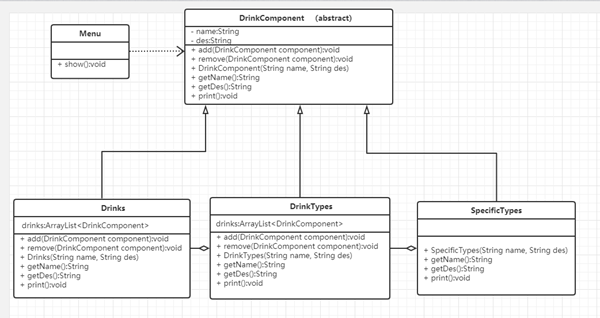                                     
## 备忘录模式
撤销删除功能，应用到了备忘录模式。没有使用备忘录模式前，备份删除前的状态需要new一个新的对象，并把需要备份的数据存到对象中，这暴露了对象内部的细节，如果需要备份的对象很多，这将不利于管理，开销也会变大。  备忘录模式能在不破坏封装性前提下，捕获对象的状态，在对象之外保存这个状态，并可用于恢复保存的状态。在订单管理下，Memento为订单orderList的备份类，careTaker用于维护以Memento为元素的List。当有订单被删除时，删除前的orderlist的状态就会被保存到careTaker的MementoList中。这时，选择撤销的话careTaker就会从List中选取上次备份的内容，完成撤回操作。

UML图：

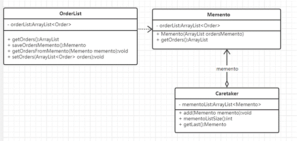                                 
## 代理模式
对vip用户和普通用户的区别计价，用到了代理模式。使用代理模式，对订单的总价格RealPrice类，提供一种代理以控制对这个对象的访问。RealPrice类（被代理类）和Proxy类（代理类)都实现同一个接口ProductPrice,在Proxy类实现实际业务逻辑，在该代理类的控制下，普通客户访问将得到原价价格，vip客户访问将得到八八折的价格。代理模式在一定程度上降低了耦合度，且如果对代理类做修改，则无需对被代理类进行改动，使得系统具有良好的灵活性和可扩展性，比如想新增一种客户类型，则直接更改代理类即可。     

UML图：

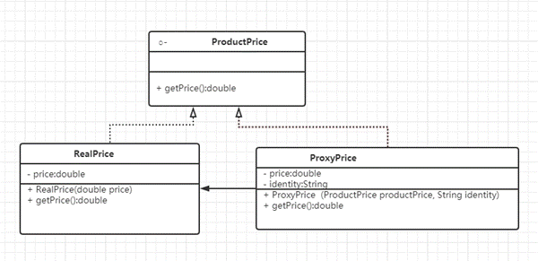                                     
## 单例模式
在图形界面中，对查看所有订单界面（GuiMain类）和增加新订单界面（GuiAdd类）会来回切换，若不使用单例模式，每次切换都要new一个新的界面对象，频繁的进行创建对象，耗费资源。   而使用单例模式，可以保证该类中只存在一个这样的对象，确保只有单个对象被创建，节省了系统资源，可以提高系统的性能。在单例模式下，查看所有订单界面（GuiMain类）和新增新订单界面（GuiAdd类）都是通过使用getInstance函数创建唯一的实例，解决了耗费资源的情况。

 UML图：

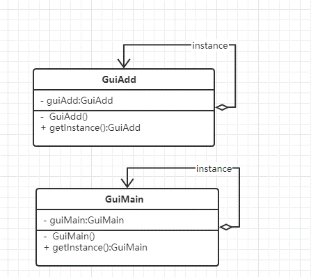                                                           3   

# 使用

打开IDEA，运行main包中的MainTest启动程序                                                    

进入程序主界面，载入已保存的订单                         

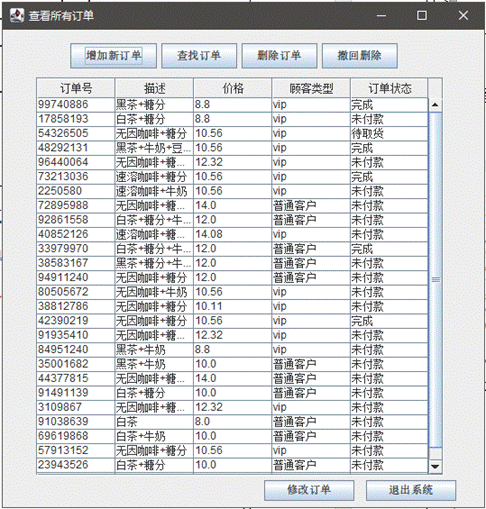                                                                      增加新订单：

                                              返回主界面，在最后一行能找到新增的订单                         

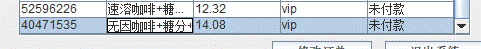                

查看商品菜单 

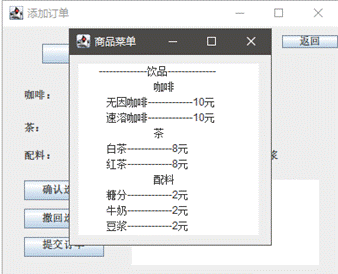

未选择客户类型时候：                        

  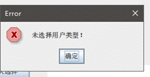                 

未确认选择情况下撤回选择                                         

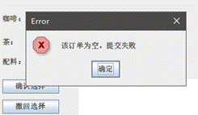              

未确认选择情况下提交订单    

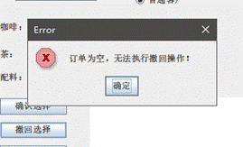                                         

存在未提交订单情况下点击确认选择：                         

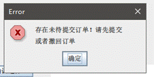                         

查找订单：                         

                                           

订单号不存在，或者订单格式有问题：                                   

  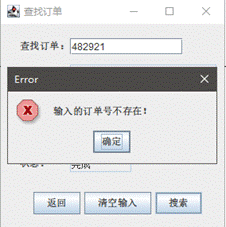        

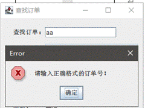                                                 

删除订单：                            

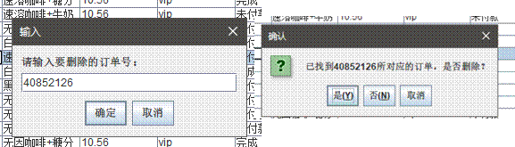                                     

订单号不存在，或者订单格式有问题：                                    

 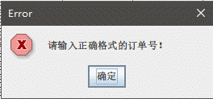        

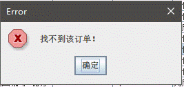                                     

 撤回删除：  执行撤回前：                         

                            

执行撤回后：                       

  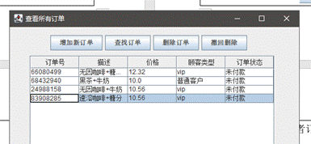                                  

不存在删除操作时：                         

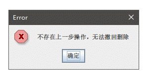                                     

修改订单：单击修改订单显示                        

 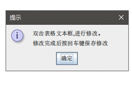                               

直接在表格上即可进行修改，修改将自动保存                         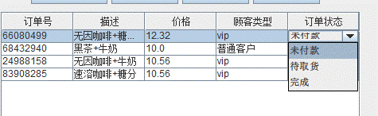                               

# 遇到的问题 

在程序调试时，遇到一个大问题，无法让显示订单的表格实时更新内容 。使用JAVA图形界面，想实现对所有订单在同一个界面显示，并且要其支持修改和保存。这种情况下用JTable可以来实现所有订单的显示。但用了JTable后，却发现订单的新增，删除，表格都不会刷新新数据，在此尝试了好多种办法解决。在经过长时间的钻研下，发现借助DefaultTableModel对象可以实现，之后再使用Vector数组存储表格每行每列的数据，调用setDataVector方法为DefaultTableModel对象存值。每次新增，删除订单都重复上述操作，使得表格内的内容能被实时更新。  

合理运用设计模式，无疑是可以简化类的数量，简化不必要的代码，使系统代码可读性更高，更简洁，且可以优化系统的性能。如对单例模式的应用，能使对象不会被重复new出来，节约系统资源。再如装饰者模式可以大幅度减少类的数量，使用decorator对特定对象添加功能，即可实现不同组合。合理运用设计模式，是可以减少类之间的耦合性，并使得系统的扩展性得到提高。  

 
